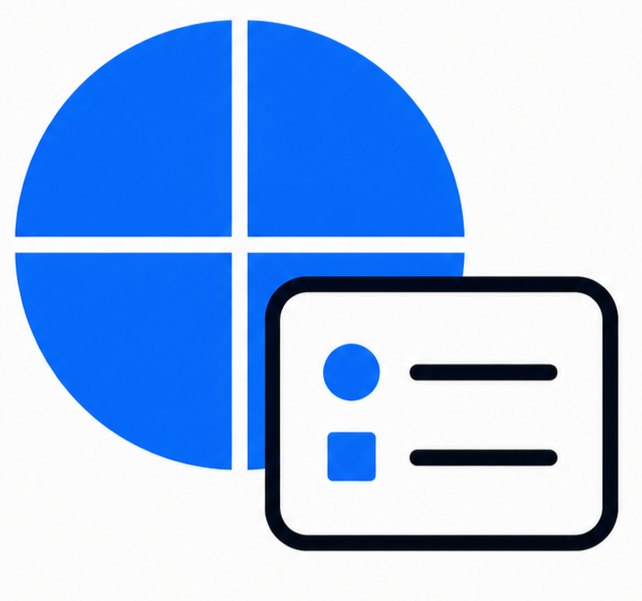

  

# GeoMetaName

A Windows desktop app for quickly inspecting metadata from one or many GeoTIFF files, without waiting for large multi-band rasters to fully load. View results in a table, export to CSV, and optionally save renamed copies using values extracted from metadata.

## Download

Download the latest Windows app from the **Releases** page:  
https://github.com/Xiangyusherry/GeoMetaName-App/releases

File to download: `GeoMetaName.exe`  
If Windows SmartScreen appears, click **More info** -> **Run anyway**.

## Features

- Select GeoTIFF files (`.tif`, `.tiff`) from local folders.
- Add files in multiple rounds (e.g., from different folders) and keep appending to the table.
- Display essential GeoTIFF metadata in a table.
- (Optional) Look up the nearest city based on the raster extent center (requires internet).
- (Optional) Export the current table to CSV.
- (Optional) Save renamed copies of selected files using one-click formatted filenames based on chosen metadata fields.

## Metadata Fields

- File name
- File path
- Raster created date
- File size (MB)
- Column count / row count
- Pixel size (x, y)
- Pixel size unit
- Number of bands
- Band names
- Pixel depth (bits)
- Pixel data type(s)
- Extent in degrees (top/bottom latitude, left/right longitude)
- Geographic coordinate system
- Projection coordinate system
- Nearest city (optional, requires internet)

## How to Use GeoMetaName

### View metadata

1. Click **Add Files** and select one or more GeoTIFFs.
2. (Optional) Click **Add Files** again to add files from other folders.
3. (Optional) Enable **Lookup nearest city**.
4. Click **Show Metadata** to load and display metadata in the table.
5. After processing, you can choose to export to CSV.
6. You can also click **Save metadata as a csv file** at any time to export the current table.

### Save renamed copies (batch)

Use this to create copies of files with clearer, metadata-based names.

1. Click **Set Label** and enter a label for each file (recommended).  
   Labels help keep names meaningful and describe what the file represents.
2. Select the files you want to copy.
3. Choose which metadata fields to include in the new filenames.
4. Click **Save Renamed Copies** to generate copies with formatted names.

## Troubleshooting

- **Nearest city is empty / NaN**
  - Internet is unavailable, or the geocoding service cannot be reached.

- **Some metadata fields show `NaN`**
  - The source GeoTIFF does not contain that metadata (or it cannot be read).

- **Renamed copies have the same filename**
  - If multiple files have the same label and the same selected metadata values, the app will append a number to make filenames unique (e.g., `_1`, `_2`, ...).

## Feedback and Support

Found a bug? Please open a **Bug report** in [Issues](../../issues/new/choose).  
Have an idea to improve GeoMetaName? Submit a **Feature request** in [Issues](../../issues/new/choose).

## Credits

- **Author:** Xiangyu Ren
- **App name:** GeoMetaName

## License

This software is licensed as **freeware, closed-source** under the terms in `LICENSE`.
See `EULA.txt` for end-user terms when distributing the executable.
